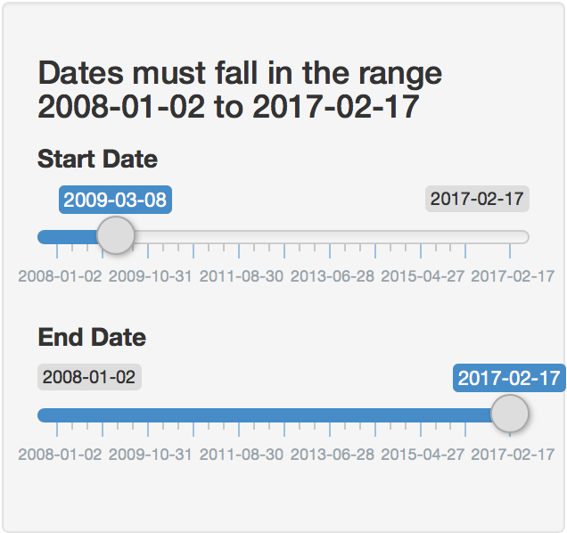
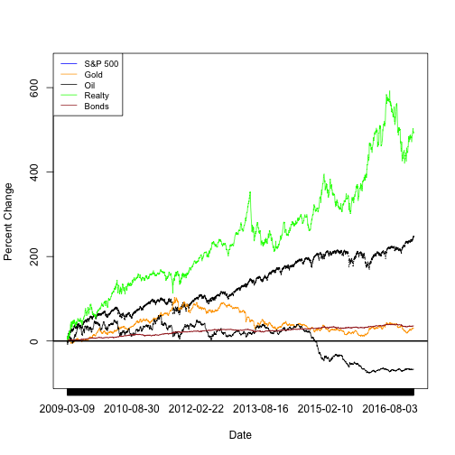

SectorTracker App
========================================================
author: William D. Downs
date: February 26, 2017
autosize: true

A Tool for Understanding the Market After a Collapse
========================================================

During the 'Great Recession' the stock market dropped to a low on March 9, 2009. SectorTracker is a shiny app that generates a plot showing the percent gain or percent loss for each of five sectors of the market from that low.
- S&P 500 (symbol: *spx*)
- Price of Gold (symbol: *gld*)
- Price of Oil (symbol: *oil*)
- Real Estate Income (symbol: *o*)
- Bond Market (symbol: *bnd*)

No Other Websites Needed!
========================================================
SectorTracker works from its own set of historic quotes:


```r
quotesDF <- read.table("quotesDF", sep=",", header=TRUE)
head(quotesDF, 3)
```

```
  X       date     spx   gld   oil        o      bnd
1 1 2008-01-02 1447.16 84.86 57.91 15.52914 57.75718
2 2 2008-01-03 1447.16 85.57 57.79 15.17215 57.83184
3 3 2008-01-04 1411.63 85.13 57.04 13.94114 57.89904
```


Choose a Range of Dates with Two Simple Sliders
========================================================
By adjusting the 'Start Date' slider and the 'End Date' slider the user can observe the percent gain/loss of all five sectors of the market over any date range within the span 2008-01-02 to 2017-02-17. 


```

Finally, SectorTracker Delivers both a Plot and Numerical Readouts
========================================================
These gains/losses are shown visually in a plot and numerically in the text below the plot. A vertical red line will mark the S&P 500's lowest point on 2009-03-09.<br><br>
[Generated on-the-fly from the code used in the SectorTracker]



